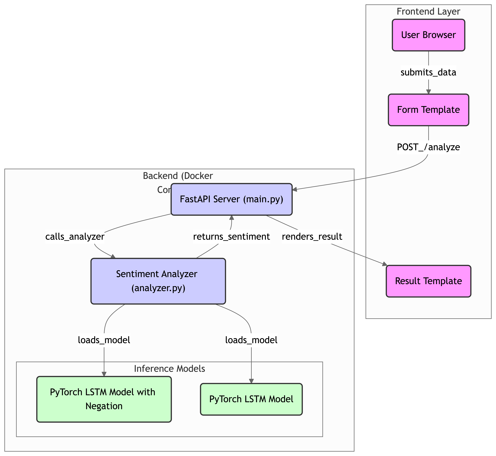

# Sentiment Analysis Service with PyTorch and FastAPI
Sentiment Analysis Web App: This project predicts sentiment (Positive/Negative) from user-provided text using a PyTorch LSTM model with attention and negation handling. Built with FastAPI for the backend and a simple HTML interface, it's scalable, deployable with Docker, and ideal for analyzing reviews or feedback.

